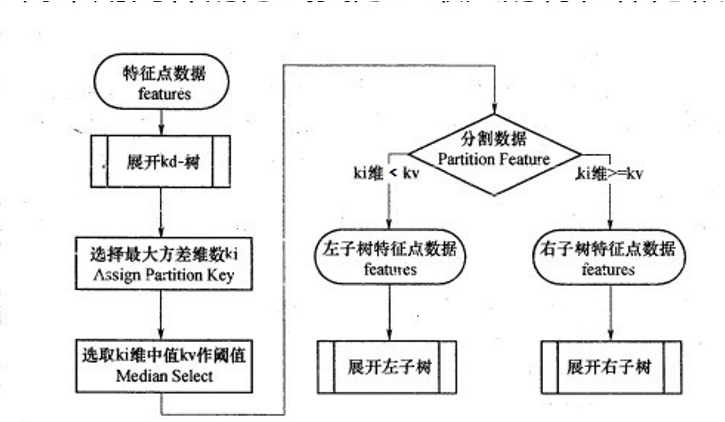
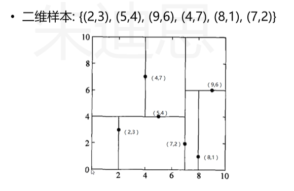
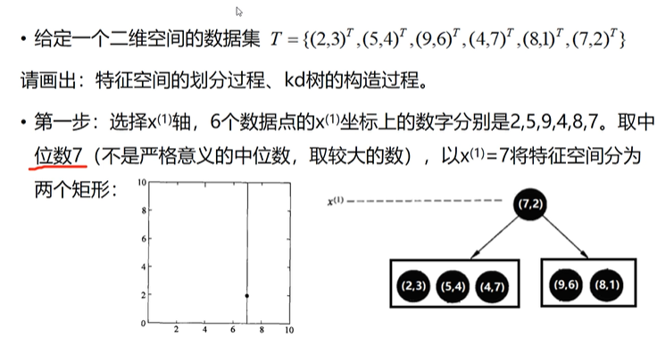
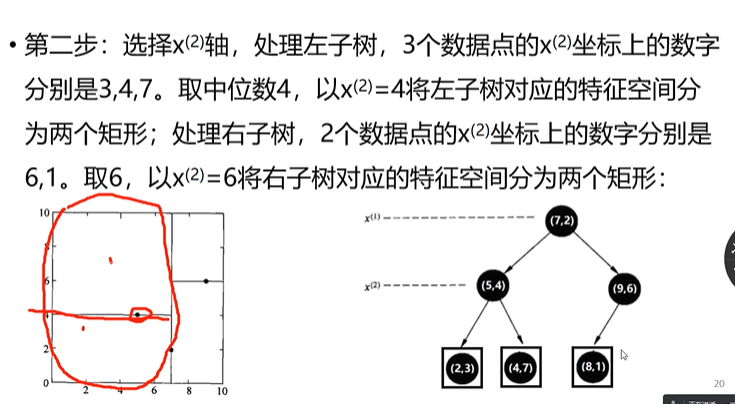
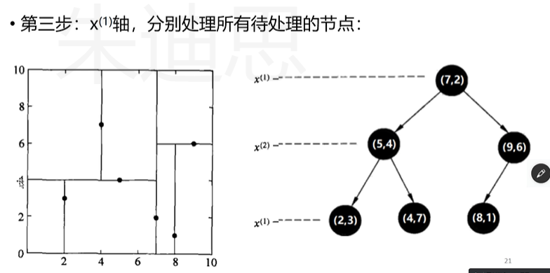
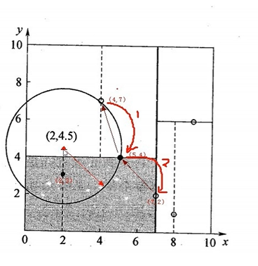

# KNN算法原理
- K近邻是一种基本的机器学习算法，K就是K个最近邻的意思。每个样本都可以用它最接近的K个邻居来代表。可用于分类应用和回归应用。
- KNN在做回归和分类的主要区别在于最后做预测的时候决策方式不同。
  - 回归预测时：一般采用平均值法
  - 分类预测时：一般采用多数表决法
- 从训练集合中获取K个离待预测样本距离很近的样本数据
- 根据获取得到的K歌样本数据来预测当前待预测样本的目标属性值

# KNN 算法的三个重要因素
- K值的选择
  - 对于K值的选择，一般根据样本分布选择较小的值，然后通过交叉验证来选择一个比较合适的最终值；
  - 当选择比较小的K值的时候，表示使用较小领域中的样本进行预测，训练误差会减少，但是会导致模型变得复杂，容易过拟合；
    - K值选择过小：训练集的准确率100%，测试集的准确率不一定好。过拟合模型
  - 当选择比较大的K值的时候，表示使用较大领域中的样本进行预测，训练误差会增大，但是模型会变得简单，容易欠拟合。
    - K值选择过大：f(x)=1 常数函数，欠拟合模型

- 距离度量
  - 欧式距离

- 决策规则
  - 分类模型
    - 多数表决法：每个邻近样本的权重是一样的，也就是说最终预测的结果为出现类别最多的那个类
    - 加权多数表决法：每个邻近样本的权重不一样，一般情况下采用权重和距离成反比的方式来计算，也就是说最终预测结果是出现权重最大的那个类别
    
  - 回归模型
    - 平均值法：每个邻近样本的权重是一样的，最终预测结果为所有邻近样本的平均值
    - 加权平均值法：每个邻近样本的权重不一样，一般情况下采用权重和距离成反比的方式来计算，也就是说在计算均值的时候进行加权操作
- 总结：
  - K值的选择：过小，容易过拟合；过大，容易欠拟合
  - 距离度量：欧式距离
  - 决策规则：多数表决法，加权多数表决法；平均值法，加权平均值法

# KNN 算法实现方式
- 蛮力实现（brute）：计算预测样本到所有训练集样本的距离，然后选择最小的k个距离即可得到k个最邻近点。缺点在于当特征数比较多、样本数比较多的时候，算法的执行效率比较低；
- （kd_tree）：KD树算法中，首选是对训练数据进行建模，构建KD树，然后再根据建好的模型来获取邻近样本数据。
- 外，还有一些从KD_Tree修改后的求解最邻近点的算法，比如：ball tree、BBF tree、MVP tree

# KNN 算法的实现
  - KNN加权投票--分类 【KNN加权算法.py】
    - 初始化数据
    - 初始化待测样本
    - 初始化邻居数
    - 初始化距离列表【距离，标签】
    - 循环每个数据点，计算dis欧氏距离
    - 对dis按照距离排序，取前K个数据点

	
# KD Tree:
- KD Tree是KNN算法中用于计算最近邻的快速、便捷构建方式。
- 数据量少的时候，我们可以使用brute这种暴力的方式进行求解最近邻，即计算到所有样本的距离。但是当样本量比较大的时候，直接计算所有样本的距离，工作量有点大，所以在这种情况下，我们可以使用kd tree来快速的计算。

# KD Tree构建方式：
- KD树采用从m个样本的n维特征中，分别计算n个特征取值的方差，用方差最大的第k维特征nk作为根节点。对于这个特征，选择取值的中位数nkv作为样本的划分点，对于小于该值的样本划分到左子树，对于大于等于该值的样本划分到右子树，对左右树采用同样的方式找到方差最大的特征最为根节点，递归即可产生KD树。
    
    
    
    
    
# KD Tree 查询最近邻：
 
- 找到所属的叶子节点后，以目标为圆心，以目标点到最近样本点（一般为当前叶子节点中的其他训练数据或者刚刚经过的父节点）为半径画圆，从最近样本点往根节点进行遍历，如果这个圆和分割节点的分割闲有交线，那么就考虑分割点的另外一个子树。如果在遍历过程中，找到距离比刚开始的样本距离近的样本，那么就进行更新操作。
- 一直迭代遍历到根节点上，结束循环找到最终的最小距离的样本

# KDTree 和 KNN的关系：
- KDTree 是 KNN 存储数据的方式，便于快速查找邻居
- KDTree 快速查找最近邻居