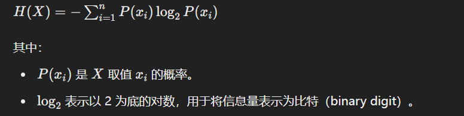
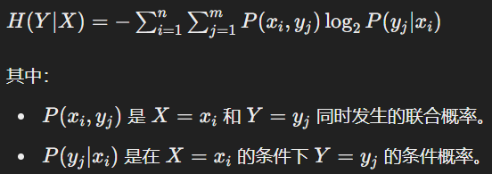
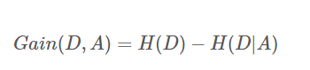
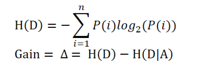
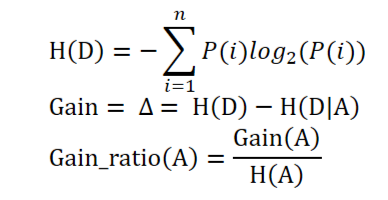
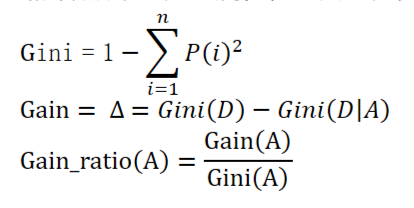
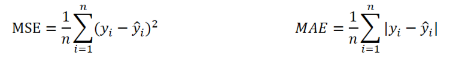

# 比特化(Bits)
- 计算机中，信息量的大小用比特(bit)表示。一个比特可以存储0或1两个状态中的任何一个。

# 信息量
- 不确定性越高，信息量越大。

# 信息熵 (Entropy)
- 信息熵衡量了一个随机变量的平均信息量。
- 度量信息熵的单位是比特。就是说，信息量的多少是可以量化的。一条信息量的多少与信息的不确定性有关，可以认为，信息量就等于不确定性的多少（信息的不确定度）。
- 熵只依赖于X的分布，而与X的取值无关，所以也可将X 的熵记作 H(p)。
- 信息熵的三条性质：
  - 单调性，即发生概率越高的时间，其所携带的信息熵越低。比如“太阳东升西落”
  - 非负性，即信息熵不能为负数。
  - 累加性，即多随机时间同时发生的总不确定性，等于各个随机时间的不确定性之和。
- 对于离散随机变量X的熵H(X)以比特为单位计算：

    
- 结论

   高H(X) ——> 均匀分布等概率 ——> 不确定度高 ——> 确定性低 ——> 混乱

   低H(X) ——> 大概率 + 小概率 ——> 不确定性低 ——> 确定性高 ——> 有序
- eg： 
  
  如果一个硬币有两个可能的结果（正面和反面），且每个结果的概率都是 0.5，则其熵为：
  H(X) = -0.5 * log2(0.5) - 0.5 * log2(0.5) = 1 bit

# 信息纯度
- 信息的纯度与信息熵成反比，可以将信息熵理解为‘不纯度’
- 信息熵越大，信息越混乱；信息熵越小，信息越有序。
- 熵越大，信息越混乱；熵越小，信息越有序。

# 条件熵 (Conditional Entropy)
- 条件熵衡量了在已知一个随机变量的条件下，另一个随机变量的不确定性。对于随机变量Y给定X的熵H(Y|X)以比特为单位计算：
    
- eg：假设我们有一个数据集，其中包含了性别（男或女）和是否通过考试（通过或不通过）两个变量。如果我们知道性别，那么给定性别下是否通过考试的不确定性就是条件熵。

# 信息增益 (Information Gain)
- 信息增益就是，在根据某个属性划分数据集的前后，信息量发生的变化。
- 信息熵代表不纯度，只要将分类前后的不纯度相减，那就可以得到一种 “纯度提升值” 的指标，我们把它叫做 “信息增益”
- 所有子节点的信息熵会按照子节点在父节点中的出现的概率来计算，这叫做归一化信息熵。
- 信息增益的目的在于，将数据集划分之后带来的纯度提升，也就是信息熵的下降。如果数据集在根据某个属性划分之后，能够获得最大的信息增益，那么这个属性就是最好的选择。 所以，我们想要找到根节点，就需要计算每个属性作为根节点时的信息增益，那么获得信息增益最大的那个属性，就是根节点。
- 特征A对训练数据集D的信息增益Gain(D, A)定义为集合D的经验熵H(D)与特征A给定条件下D的经验条件熵H(D|A)之差
  

# 决策树（decision tree）
- 决策树（decision tree）是在已知各种情况发生概率的基础上，通过构建决策树来进行分析的一种方式，是一种直观应用概率分析的一种图解法；决策树是一种预测模型，代表的是对象属性与对象值之间的映射关系；决策树是一种树形结构，其中每个内部节点表示一个属性的测试，每个分支表示一个测试输出，每个叶节点代表一种预测类别；决策树是一种非常常用的有监督的分类算法
决策树的决策过程就是从根节点开始，测试待分类项中对应的特征属性，并按照其值选择输出分支，直到叶子节点，将叶子节点的存放的类别作为决策结果
决策树分为两大类：分类树和回归树，前者用于分类标签值，后者用于预测连续值，常用算法有ID3,C4.5,CART等
决策树（decision tree）是在已知各种情况发生概率的基础上，通过构建决策树来进行分析的一种方式，是一种直观应用概率分析的一种图解法；决策树是一种预测模型，代表的是对象属性与对象值之间的映射关系；决策树是一种树形结构，其中每个内部节点表示一个属性的测试，每个分支表示一个测试输出，每个叶节点代表一种预测类别；决策树是一种非常常用的有监督的分类算法
- 决策树的决策过程就是从根节点开始，测试待分类项中对应的特征属性，并按照其值选择输出分支，直到叶子节点，将叶子节点的存放的类别作为决策结果
- 决策树分为两大类：分类树和回归树，前者用于分类标签值，后者用于预测连续值，常用算法有ID3,C4.5,CART等

# 决策树算法
- ID3算法：

  ID3建立在奥卡姆剃刀（用较少的东西，同样可以做好事情）的基础上：越是小型的决策树越优于大的决策树。
  内部使用信息熵以及信息增益来进行构建；每次迭代选择信息增益最大的特征属性作为分割属性
    - ID3算法只支持离散的特征属性，不支持连续的特征属性
    - ID3算法构建的是多叉树
    - 公式：
      
    - 计算步骤：
      - 初始化特征集合和数据集合
      - 计算数据集合信息熵和所有特征的条件熵，选择信息增益最大的特征作为当前决策节点
      - 更新数据集合和特征集合（删除上一步使用的特征，并按照特征值来划分不同分支的数据集合）
      - 重复 2，3 两步，若子集值包含单一特征，则为分支叶子节点
    - 算法优缺点：
      - 优点：
          1. ID3算法简单易实现，计算量小，速度快，容易理解

      - 缺点：
          1. 计算依赖于特征取值数目较多的特征，而属性值最多的属性并不一定最优 
          2. ID3算法不是递增算法
          3. ID3是单变量决策树，对于特征属性之间的关系不会考虑
          4. 抗噪声能力差，对异常值不敏感
          5. 只适合小规模数据集，需要将数据放在内存中
- C4.5算法：
  在ID3算法的基础上，进行算法优化提出的一种算法（C4.5）

  现在C4.5已经是特别经典的一种决策树构建算法；使用信息增益率来取代ID3算法中的信息增益，在树的构建过程中会进行剪枝操作进行优化

  能够自动完成对连续属性的离散化处理；C4.5构建的是多分支的决策树；C4.5算法在选中分割属性的时候选择信息增益率最大的属性，涉及到的公式为：
    
  - 算法优缺点：
    - 优点：
      1. 产生的规则易于理解
      2. 准确率较高
      3. 实现简单
    - 缺点：
      1. 对数据集需要进行多次顺序扫描和排序，所以效率低
      2. 只适合小规模数据集，需要将数据放在内存中

- CART算法：
  使用基尼系数（分类树）作为数据纯度的量化指标来构建的决策树算法就叫做CART（classification and regression tree ，分类回归树）算法。CART算法使用GINI增益率作为分割属性选择的标准，选择GINI增益率最大的作为当前数据集的分割属性；可用于分类和回归两类问题。强调备注：CART构建是二叉树
  - 公式：
  

# ID3、C4.5、CART算法的优缺点

# 剪枝策略
- 为什么要剪枝：过拟合的树在泛化能力的表现非常差。

# 预剪枝
- 在节点划分前来确定是否继续增长，及早停止增长的主要方法有：
  - 节点内数据样本低于某一阈值；
  - 所有节点特征都已分裂；
  - 节点划分前准确率比划分后准确率高。
  - 预剪枝不仅可以降低过拟合的风险而且还可以减少训练时间，但另一方面它是基于“贪心”策略，会带来欠拟合风险。

# 后剪枝
- 在已经生成的决策树上进行剪枝，从而得到简化版的剪枝决策树。
- C4.5 采用的悲观剪枝方法，用递归的方式从低往上针对每一个非叶子节点，评估用一个最佳叶子节点去代替这课子树是否有益。如果剪枝后与剪枝前相比其错误率是保持或者下降，则这棵子树就可以被替换掉。C4.5 通过训练数据集上的错误分类数量来估算未知样本上的错误率。
- 后剪枝决策树的欠拟合风险很小，泛化性能往往优于预剪枝决策树。但同时其训练时间会大的多。

# 分类和回归树的区别
- 分类树采用信息增益、信息增益率、基尼系数来评价树的效果，都是基于概率值进行判断的；而分类树的叶子节点的预测值一般为叶子节点中概率最大的类别作为当前叶子的预测值
  在回归树中，叶子节点的预测值一般为叶子节点中所有值的均值来作为当前叶子节点的预测值。所以在回归树中一般采用MSE或者MAE作为树的评价指标，即均方差和平均绝对误差
  
- 一般情况下，只会使用CART算法构建回归树

# 决策树可视化
- graphivz服务安装（Windows的安装）：
  - 下载安装包：http://www.graphivz/org
  - 将graphivz的根目录下的bin文件夹路径添加到path环境变量中
- 安装python插件graphivz：pip install graphivz
  - 找不到graphivz的解决方案：
    Import os
    Os.environ['PATH'] += os.pathsep + graphivz/bin
-安装python插件pydotplus: pip install pydotplus