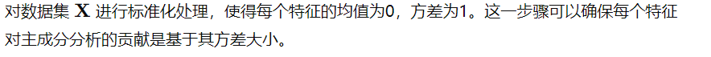

# 特征降维
 - 降维是指在某些限定条件下，降低随机变量（特征）个数，得到一组”不相关“主变量的过程
 - 为在进行训练的时候，我们都是使用特征进行学习。如果特征本身存在问题或者特征之间相关性较强，对于算法学习预测会影响较大
 - 降两种方式
	- 特征选择
    - 分析 PCA（可以理解一种特征提取的方式）矩阵变换，特征空间

# 什么是特征选择
数据中包含冗余或无关变量（或称特征、属性、指标等），旨在从原有特征中找出主要特征
	
# 特征选择
 - 特征选择的方法主要有以下三种：
    - Filter：过滤法，按照发散性或者相关性对各个特征进行评估，设定阈值或者待选阈值的个数，从而选择特征；常用方法包括方差选择法、相关系数法、卡方检验、互信息法等
    - Wrapper：包装法，根据目标函数（通常是预测效果评分），每次选择若干特征或者排除若干特征；常用方法主要是递归特征消除法
    - embedded：嵌入法，先使用某些机器学习的算法和模型进行训练，得到各个特征的权重系数，根据系数从大到小选择特征（L1,L2）；常用方法主要是基于惩罚项的特征选择法
    - KNN
    - Linear/lasso/ridge/en
    - Ligistic/softmax

# 特征降维
 - 当特征选择完成后，可以直接进行模型训练，但可能由于特征矩阵过大，导致计算量比较大，训练时间长的问题，因此降低特征矩阵维度也是必不可少的。常见的降维方法除了基于L1的惩罚模型外，还有主要分析法（PCA）或者线性判别分析法（LDA），这两种方法的本质都是将原始数据映射到维度更低的样本空间中；但是采用的方式不同，PCA是为了让映射后的样本具有更大的发散性，PCA是无监督的学习算法,LDA是为了让映射后的样本有最好的分类性能，LDA是有监督学习算法
# PCA原理
 - PCA(principal component analysis)是常用的线性降维方法，是一种无监督的降维算法。算法目标是通过某种线性投影，将高维的数据映射到低纬的空间中表示，并且期望在所投影的维度上数据的方法最大（最大方差理论），一次使用较少的数据维度，同时保留较多的原数据点的特性
 - 通俗来讲的话，如果将所有点映射到一起，那么维度一定降低下去了，但同事也会将机会所有的信息（包括点点之间的距离等）都丢失； ，而如果映射之后的数据具有比较大的方法，那么可以认为数据点则会比较分散，这样的话，就可以保留更多的信息。从而我们可以看到PCA是一种丢失原始数据信息最少得无监督线性降维方式
 - 在PCA降维中，数据从原来的坐标系转换为新的坐标系，新坐标系的选择由数据本身的特性决定。第一个坐标轴选择原始数据中方差最大的方向，从统计角度来讲，这个方向是最重要的方向；第二个坐标轴选择和第一个坐标轴垂直或者正交的方向；第三个坐标轴选择和第一个、第二个坐标轴都垂直或者正交的方向；该过程一直重复，直到新坐标系的维度和原始坐标系维度数目一致的时候结束计算。而这些方向所表示的数据特征就被称为“主成分”
 - PCA本质是无监督的矩阵变换过程，等价于SVD分解

# PCA实现步骤
 - 数据标准化：
   
 - 计算协方差矩阵：
   
 - 计算特征值和特征向量：
   
 - 选择主成分：
   
 - 投影数据集：
   
 - 数学公式说明：
   
# LDA原理
 - LDA的全称是linear  discriminant analysis（线性判别分析，是一种有监督学习算法）
 - LDA的原理是，将带上标签的数据（点），通过投影的方法，投影到维度更低的空间中，使得投影后的点，会形成按类别区分，一簇一簇的情况，相同类别的点，将会在投影后的空间中更接近。用一句话概括就是：投影后类内方差最小，类间方差最大

# LDA实现步骤
  - 计算类内均值向量（Within-class mean vectors）：
    
  - 计算类内散布矩阵（Within-class scatter matrix）：
    
  - 计算类间散布矩阵（Between-class scatter matrix）：
    
  - 求解广义特征值问题：
    
  - 选择投影方向：
    
  - 降维：    
    
  - 数学公式说明：
    
# PCA和LDA
 - 相同点：
   - 两者均可以对数据完成降维操作
   - 两者在降维时使用矩阵分解的思想
   - 两者都假设数据符合高斯分布
 - 不同点：
   - LDA是监督降维算法，PCA是无监督降维算法
   - LDA降维最多降到类别数目k-1的维数，而PCA没有限制
   - LDA除了降维外，还可以应用于分类
   - LDA选择的是分类性能最好的投影，而PCA选择样本点投影具有最大方差的方向

# 降维一般是在数据清洗、特征选择、特征转换之后做

# 特征选择/降维
   - 在实际的机器学习项目中，特征选择/降维是必须进行的，因为在数据中存在以下几个方面的问题：
     - 数据的多重共线性：特征属性之间存在着相互关联关系。多重共线性会导致解的空间不稳定，从而导致模型的泛化能力弱
     - 高纬空间样本具有稀疏性，导致模型比较难找到数据特征
     - 过多的变量会妨碍模型查找规律
     - 仅仅考虑单个变量对于目标属性的影响可能忽略变量之间的潜在关系
   - 通过降维的目的是：
     - 减少特征属性的个数
     - 确保特征属性之间是相互独立的

# 特征工作做一个总结
 - 所有一切为了让模型效果变的更好的数据处理方式都可以认为属于特征工程这个范畴中的一个操作
 - 至于需求做不做这个特征工程，需要我们在开发过程中不断的进行尝试
 - 常规的特征工程需要处理的内容：
   - 异常数据的处理
   - 数据不平衡处理
   - 文本处理：词袋法、TF-IDF
   - 多项式扩展、哑编码、标准化、归一化、区间缩放法、PCA、特征选择…
   - 将均值、方差、协方差等信息作为特征属性，对特征属性进行对数转换、指数转换…
   - 结合业务衍生出一些新的特征属性…
