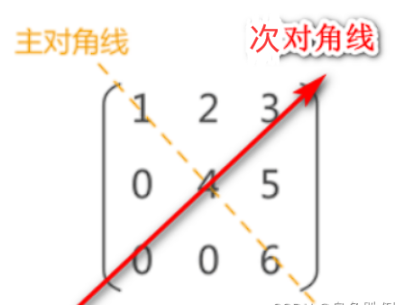
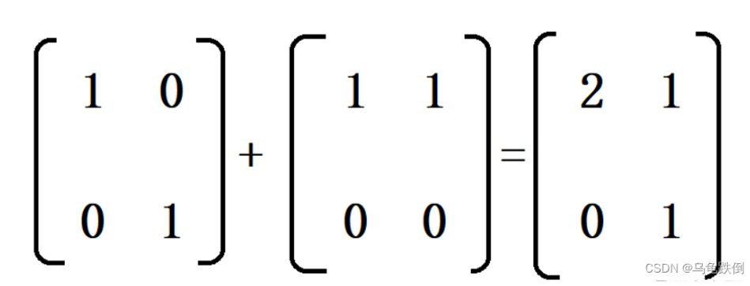
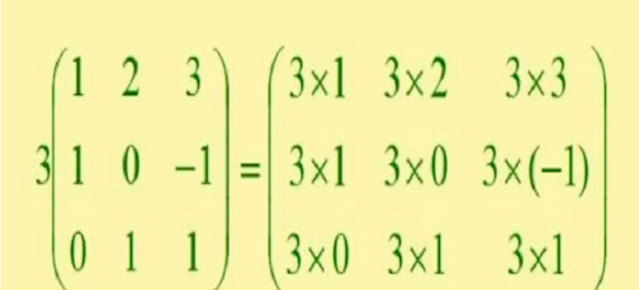
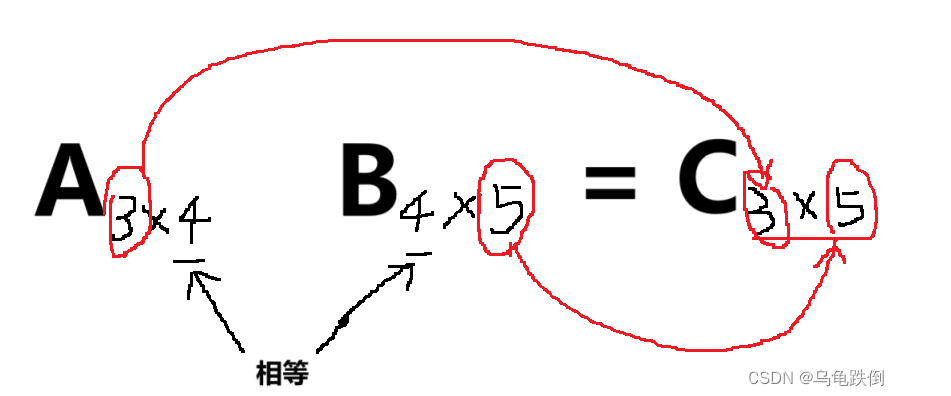

# 一、矩阵的基本概念
矩阵本质上是一个数表，用Am×n的方阵表示，代表一个m×n的矩阵，m是行数，n是列数。

    4×4的矩阵：
    
      | 0 | 1 | 0 | 0 |
      | 0 | 0 | 1 | 1 |
      | 1 | 1 | 0 | 1 |
      | 1 | 0 | 0 | 0 |

## 1.行矩阵与列矩阵
- 只有1行的矩阵，称为行矩阵：
  - 行矩阵： 
    - | 0 | 1 | 0 | 0 |
- 只有1列的矩阵，称为列矩阵：
  - 列矩阵：
    - | 0 | 
      | 0 | 
      | 1 | 
      | 1 | 

## 2.零矩阵
- 零矩阵：所有元素都为0的矩阵。

  | 0 | 0 | 0 | 0 | 
  | 0 | 0 | 0 | 0 | 

## 3.负矩阵
- 负矩阵：把原来矩阵的所有元素都取符号，为相反数，称为负矩阵。

  A = | 0 | 1 | 0 | 0 | 
  -A = | 0 | -1 | 0 | 0 | 

## 4.方阵
### 4.1 定义
行数等于列数的矩阵称为方阵，一般也称为n阶矩阵，即An×n,亦An。eg:上面的4*4矩阵。
### 4.2 主对角线和次对角线
  - 主对角线：从左上到右下，依次为1,4,6
  - 副对角线：从左下到右上，依次为0,4,3
    

## 5.单位矩阵
对角线为1，其余元素为0，这种矩阵称为单位矩阵。记作E(宋浩版)或者I(Gilbert Strang版).
  | 1 | 0 | 0 | 
  | 0 | 1 | 0 | 
  | 0 | 0 | 1 | 

## 6.只有一个数字的矩阵
只有一个数字的矩阵称为标量矩阵。
  | 1 | 

## 7.同型矩阵
- 如果两个矩阵的行数和列数相同，则称这两个矩阵是同型的。
- 如果同型矩阵的对应元素相等，那么两个矩阵相等。即相等矩阵的前提是同型矩阵。

# 二、矩阵与行列式的区别
## 1.本质上，矩阵是一个数表，而行列式是一个数。
## 2.符号：矩阵使用 () 或者 [ ]，而行列式使用 ||。
## 3形状上，矩阵不一定是方阵，但是行列式一定是一个方阵，即行数等于列数。

# 三、矩阵的运算
## 1.矩阵的加法与减法
- 矩阵的加法和减法，是对应元素相加减。
- 只有同型矩阵才可以进行加减。

- 矩阵加减法运算法则：
  A+B=B+A 
  (A+B+C)=A+(B+C) 
  A+(-A)=0 
  A+B=C<=>A=C-B 
## 2.矩阵的数乘法
- k乘以矩阵的所有元素

- 矩阵数乘和行列式的区别
  - 矩阵提公因子：矩阵所有元素均有公因子，公因子朝外提一次
  - 行列式提公因子：一行（或者一列）提取一次，如果所有元素都有公因子，有n行则提n次。
- 矩阵数乘运算法则：

  k(A+B) = kA + kB 
  (k+m)A = kA + mA 
  k(mA) = kmA  

#四、矩阵的乘法
## 1.矩阵乘法定义
- 第一行乘以第一列，先相乘后相加。
- 矩阵相乘的前提条件：第一个矩阵的列数等于第二个矩阵的行数。
- 结果矩阵的形状：结果矩阵的行等于第一个矩阵的行数，结果矩阵的列数等于第二个矩阵的列数。
- 中间相等取两头：
  eg：A2×3，A3×2，结果为2×2的方阵
 
## 2.矩阵乘法不满足的三条规则
### 1）AB!=BA 一般不满足交换律
eg：A5×2，B2×3，可以相乘，满足中间相等。但是B2×3，A5×2，不可以，中间3和5不相等。
### 2）AB=0,且A!=0 不能推出B=0
eg：如果是数学运算中，xy=0，则可以推出x/y=0。但是矩阵运算中不可以
### 3）AB=AC,且A!=0 不能推出B=C
eg：同样的，在数字运算中，3x= 3y可以推出x=y，但是在矩阵运算中不可以
### 总结矩阵不满足的三条规律：
(1)AB ! = BA;

(2)AB = AC,A!=0 不能推出 B = C;  

(3)AB = 0 不能推出A =0或B = 0; 

（任何矩阵和0矩阵相乘都等于0矩阵，由于矩阵乘法的特殊性，需要注意0矩阵的形状）

## 3.矩阵乘法的运算规律 
1）结合律 (AB)C  = A(BC)

2)分配律 (A+B)C = AC + BC  C(A+B) =  CA + CB  （注意，由于矩阵乘法的特殊性，矩阵的左右位置是有严格意义的，不能随意换，即矩阵的乘法不满足交换律）

3）k(AB) = (kA)B = A(kB) 对于一个数字来说，位置可以随意放置

（注意，对于上述三个运算规律来说，要保持矩阵乘法的先后位置，左乘和右乘的位置不能变）

## 4.矩阵的可交换
当AB = BA ，即A与B可以交换。当题目给你A与B可交换时，就在提醒你AB = BA

（相等矩阵：同型矩阵对应元素相等）

可交换的前提必须是同型方阵。

否则：

  A2×3 B3×2 = C2×2 AB的结果矩阵是2✖2的矩阵

  B3×2 A2×3 = C3×3 BA的结果矩阵是3✖3的矩阵

这里结果明显是不相等的！所以，如果不是同型方阵是不可以交换的。首先结果矩阵的形状就要出错

# 五、矩阵的幂运算
（注意：矩阵的幂运算必须是方阵,保证连续运算）

矩阵的幂运算：A^k = AA...A

其中A^0 = I
* 性质1）A^k1 A^k2 = A^(k1+k2)
* 性质2）(A^k1)k2 = A^(k1k2)
* 
(再次注意：矩阵的乘法不满足交换律)

  (AB)^k != A^kB^k

   eg：(AB)^2 != A^2B^2

因为(AB)^2 = ABBA，A^2B^2 = AABB

# 我们永远要记住：矩阵的乘法不满足交换律，因此上式明显式不相等的。除非AB可交换，即AB = BA.
同时，(A+B)^2 = A^2 + B^2 + 2AB

证明：(A+B)(A+B) = (A+B)A + (A+B)B = A^2 + B^2 + BA + AB

很明显，2AB != BA + AB 

同理，(A-B)^2 = A^2 - 2AB + B^2 

证明：(A-B)(A-B) = (A-B)A - (A-B)B = A^2 - BA - AB + B^2

很明显，2AB != -BA - AB

矩阵乘法要严格注意AB的先后位置，位置的变化是会影响运算结果的。（因为矩阵的乘法是第一个矩阵的行   乘以    第二个矩阵的列）

但是，对于

(A+E)^2 = A^2 + AE + EA + E^2

(A-E)^2 = A^2 - AE - EA + E^2

对于上两式来说，任何矩阵乘以单位阵E的等于其本身，，而对于单位阵来说，左乘和右乘是一样的。

故而，AE = EA , BE =EB

所以：

  (A+E)^2 = A^2 + AE + EA + E^2

  (A-E)^2 = A^2 - AE - EA + E^2

是成立的

[来源](https://blog.csdn.net/qq_51216031/article/details/134521526?utm_medium=distribute.pc_relevant.none-task-blog-+2~default~baidujs_baidulandingword~default-0-134521526-blog-124147360.235^v43^pc_blog_bottom_relevance_base4&spm=1001.2101.3001.4242.1&utm_relevant_index=1
)