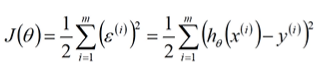

# 什么是回归算法
- 有监督算法，用来建立解释变量（自变量X）和观测量（因变量Y）之间的关系。
- 从机器学习的角度来讲，用于构建一个算法模型（函数）来做属性（X）与标签（Y）之间的映射关系，在算法的学习过程中，试图寻找一个函数h:R^d->R，使得参数之间的关系拟合性最好。
- 回归算法中算法（函数）的最终结果是一个连续的数据值，输入值（属性值）是一个d维度的属性/数值向量

# 线性回归
- y=ax+b
- h(x)=θ0+θ1*x1+θ2*x2
- 最终要求是计算出θ的值，并选择最优的θ值构成算法公式。训练θ（参数向量）
- 认为数据中存在线性关系,也就是特征属性X和目标属性Y之间的关系是满足线性关系
- 在线性回归算法中，找出的模型对象是期待所有训练数据比较均匀的分布在直线或者平面的两侧
- 在线性回归中，最优模型也就是所有样本（训练数据）离模型的直线或者平面距离最小

# 最小二乘
- 线性回归模型最优的时候是所有样本的预测值和实际值之间差值最小化，由于预测值和实际值之间的差值存在正负性，所有要求平方后的值最小化。也就是可以得到如下的一个目标函数（损失函数）:
   

# 目标函数
- 目标函数是用来衡量预测值和实际值之间的差值的，也就是损失函数。
 - 0-1损失函数
 - 感知器损失函数
 - 平方损失函数
 - 绝对损失函数
 - 对数损失函数

# 均方误差
- 均方误差（Mean Squared Error，MSE）是用来衡量预测值和实际值之间的差值的。
- 均方误差是用来衡量预测值和实际值之间的差值的，也就是损失函数。
- 计算步骤：
  - 计算误差：对于每个数据点，计算预测值与实际值之间的差值，这个差值称为误差。
  - 平方误差：将每个误差值平方，这样可以使所有的差值都为正，并且放大较大的误差。
  - 平均平方误差：将所有平方误差的和除以数据点的数量，得到均方误差。
    - eg:
      - 假设有一组实际的房屋租赁价格和你用模型预测的租赁价格。
      - 对于每一对实际价格和预测价格，计算它们之间的差异。
      - 把这些差异平方，以确保它们都是正值并且更关注大的误差。
      - 计算所有平方差异的平均值，这就是均方误差。
- MSE 越小，表示模型的预测越准确，因为预测值与实际值之间的差异越小。

# 决定系数
- 决定系数（R^2）是是衡量回归模型解释数据变异程度的指标。它的值在 0 到 1 之间：
  - R² = 1 表示模型完美地解释了数据，即所有的预测值都与实际值完全一致。
  - R² = 0 表示模型没有解释任何数据的变异，即预测值只是简单地等于实际值的平均值。
  - 0 < R² < 1 表示模型能解释部分数据的变异。
- 计算步骤：
  - 总平方和（SST）：计算所有实际值与它们平均值之间的平方差和，这表示数据的总变异。
  - 残差平方和（SSE）：计算所有实际值与预测值之间的平方差和，这表示未被模型解释的变异。
  - 计算 R²：用 1 减去残差平方和除以总平方和的比值，得到 R²。
    - eg：
    - 假设有一组实际的房屋租赁价格和你用模型预测的租赁价格。
    - 首先，计算所有实际租赁价格与它们平均值之间的差异，这表示数据本身的变异性。
    - 然后，计算实际租赁价格与预测价格之间的差异，这表示模型未能解释的变异性。
    - R² 表示模型解释的数据变异性与总数据变异性的比率。R² 越接近 1，表示模型对数据的解释能力越强。
- R² 量化了模型解释数据变异的程度，值越接近 1 越好。

# 最大似然
- 最大似然估计（MLE）是利用概率分布来估计未知参数的一种方法。