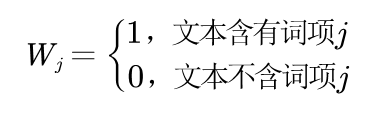
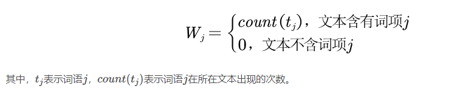
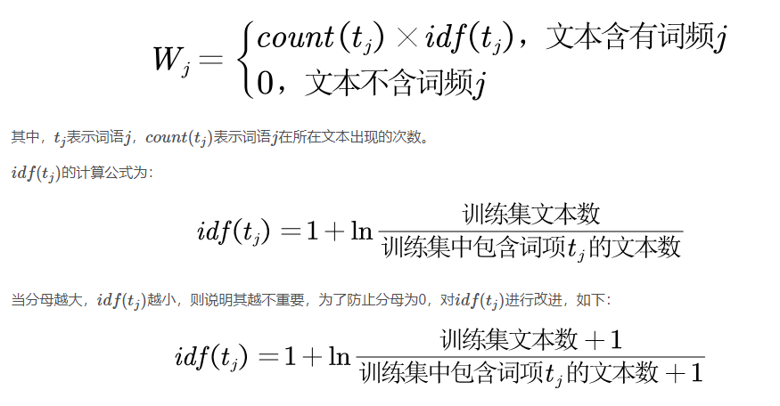

# 词袋模型基本概念
- 词袋模型（Bow，Bag of Words）不考虑文本中词与词之间的上下文关系，仅仅只考虑所有词的权重（与词在文本中出现的频率有关），类似于将所有词语装进一个袋子里，其中每个词的出现都是独立的，不依赖于其他词是否出现。这种模型的主要目的是将文本转换为一个向量，其中向量的每个维度代表一个词，而该维度的值则表示该词在文本中出现的频率。
- 词袋模型的主要特征是：每个词的出现都是独立的，相当于每次随机试验为随机从词表中抽取一个单词，进行n次独立重复试验，因此适合使用多项式朴素贝叶斯

# 词袋模型的表示方法
 1. 三大方法 
    - OneHot（独热表示法）
      - One-Hot表示法的数值计算规则为：词语序列中出现的词语的数值为1，词语序列中未出现的词语的数值为0。其数学表达式为：
       
    - 词频表示法（Term Frequency, TF）
      - TF表示法的数值计算规则为：词语序列中出现的词语的数值为该词语在所在文本中的频次，词语序列中未出现的词语的数值为0。其数学表达式为：
        
      - 其中，tj 表示词语j ，count(tj)表示词语j 在所在文本出现的次数。
    - 词频-逆文档频率表示法（TF-IDF）
      - TF-IDF的核心思想是：
        - 如果某个词语在文本中频繁出现，则认为该词语很重要
        - 如果某个词语在文本中频繁出现，但该词语在每篇文档都出现，则认为该词语不是特别重要，比如“的”字每篇文章都出现，但是重要性不大
      - TF-IDF表示法的数值计算规则为：词语序列中出现的词语的数值为词语在所在文本中的频次乘以词语的逆文档频率，词语序列中未出现的词语的数值为0。其数学表达式为：
        